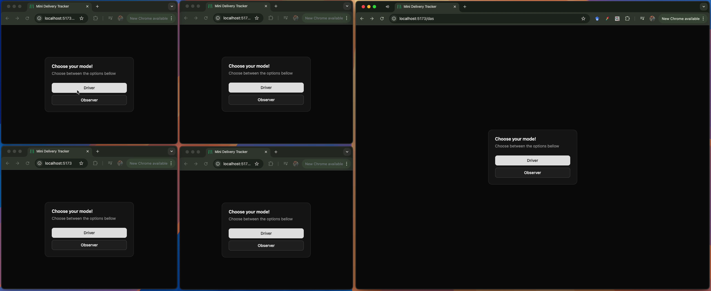
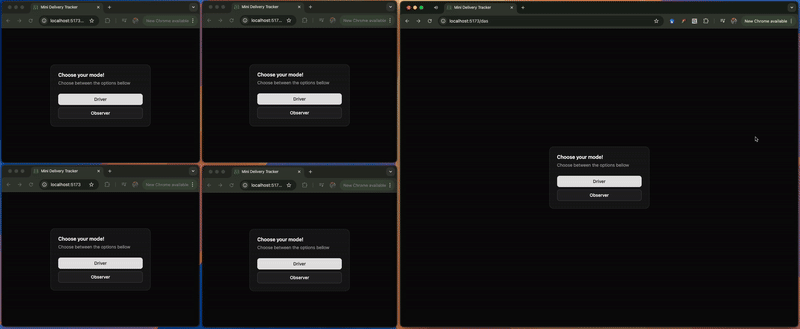
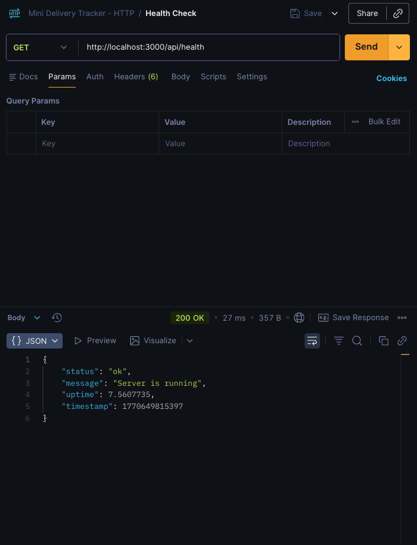
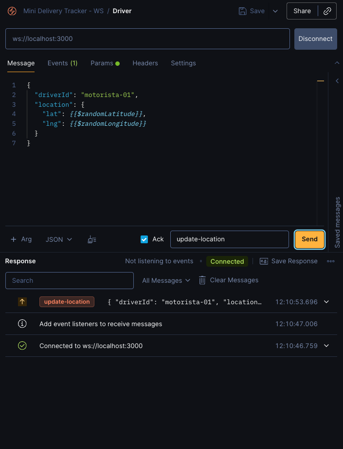
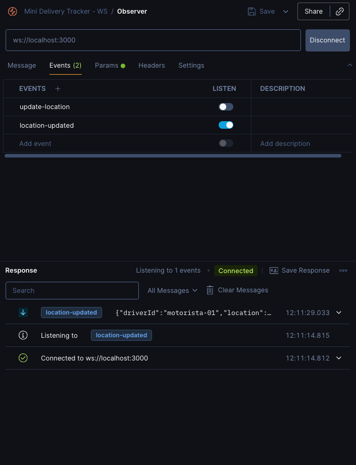

# Mini Delivery Tracker

A small project for testing Websockets using `Node.js`, `Typescript`, `Express` and `Socket.io`.

This project implements a real-time delivery tracking application. It allows a driver to broadcast their location and an observer to see the driver's location updated in real-time on a map.

## Frontend Snapshots

#### Mode Selection

A simple page to choose between driver and observer mode.



#### Driver/Observer View



## How to Run

### Individual Packages

**Backend**

```bash
npm run dev:back
```

**Frontend**

```bash
npm run dev:front
```

### Concurrently (prefer)

To run both the backend and frontend at the same time:

```bash
npm run dev
```

## Message Flow

The backend uses WebSockets (with Socket.io) to enable real-time communication between the driver and the observer.

1.  **HTTP Health Check**: The backend provides an HTTP endpoint for health checks.

    

2.  **Driver Connection**: The driver connects to the WebSocket server and emits location updates.

    

3.  **Observer Connection**: The observer connects to the WebSocket server and receives the driver's location updates.

    

## Project Structure

This project is a monorepo using npm workspaces.

- `packages/backend`: An Express.js server that handles WebSocket connections for real-time communication.
- `packages/frontend`: A React application (built with Vite) that provides the user interface for the driver and observer.
- `packages/shared`: A package containing shared types and interfaces used by both the frontend and backend, ensuring consistency. For example, it defines the structure of `ILocation` and `IDeliveryUpdate`.

## Available Scripts

### Root

- `npm run dev:back`: Runs the backend development server.
- `npm run dev:front`: Runs the frontend development server.
- `npm run dev`: Runs both the backend and frontend development servers concurrently.

### Backend

- `npm run dev`: Runs the backend development server with `tsx watch`.

### Frontend

- `npm run dev`: Starts the frontend development server using `react-router dev`.
- `npm run build`: Builds the frontend for production.
- `npm run lint`: Lints the frontend code.
- `npm run preview`: Previews the production build.
